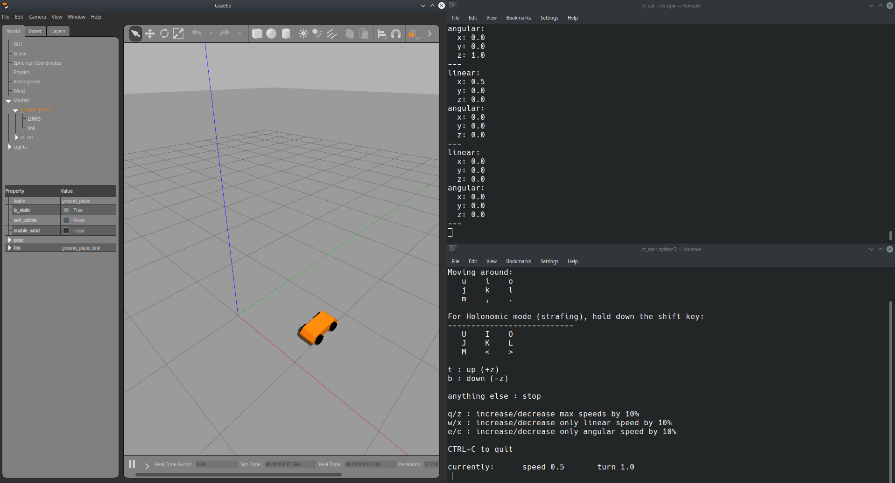
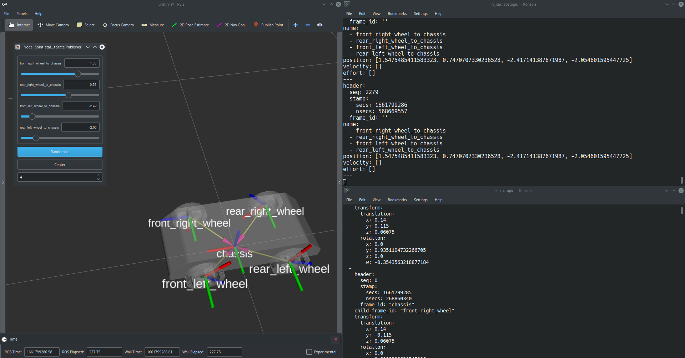

# Simple RC Car in ROS

## Description:

This is example describes model of an RC car that can be controlled using input from the keyboard or remotely using ROS Android Application. It leverages Xacro to overcome the shortcomings of URDF. The robot can be simulated in Gazebo and Rviz. `differential_drive_controller` plugin is used to control the movement of wheels in Gazebo while `teleop_twist_keyboard` is used to publish inputs to `cmd/vel` topic in the form of `geometry_msgs/Twist`. For Rviz, `joint_state_publisher` node sends the input while `robot_state_publisher` node publishes the 3D pose of links. 

---
## Important files:

1. car.xacro : The main files that contains the robot description. Robot is composed of two major meshes: chassis and wheels.  **Wheel Definition** snippet defines the wheel macro which can be called when describing each of the four wheels. This saves us the effort of defining properties for each wheel. `in_inert` macro uses conditional arguments to assign mass, center of mass and moment of inertia to each part. The moment of inertia values have been calculated in SolidWorks and are scaled according to the assigned mass. 

2. rc_car_gz.launch: launch file for loading model to parameter sever and starting Gazebo. `roslaunch rc_car rc_car_gz.launch`

3. rc_car.launch: this file, after loading the model in parameter server, starts Rviz based on the `rviz/urdf.rviz` description. It also launches `joint_state_publisher` and `robot_state_publisher` node. `roslaunch rc_car rc_car.launch model:='urdf/car.xacro'` 

---
## Miscellaneous:
- `rosrun xacro xacro car.xacro > car.urdf`: Parsing Xacro to URDF.
- `rosrun teleop_twist_keyboard teleop_twist_keyboard.py`: Starting the teleop key node.
- [Running teleop node on mobile device.](https://github.com/ROS-Mobile/ROS-Mobile-Android/wiki/Tutorials)

---

**Gazebo with /cmd_vel(top right) and teleop twist keyboard(bottom right)**

**Rviz with /joint_states(top right) and /tf(bottom right)**

---